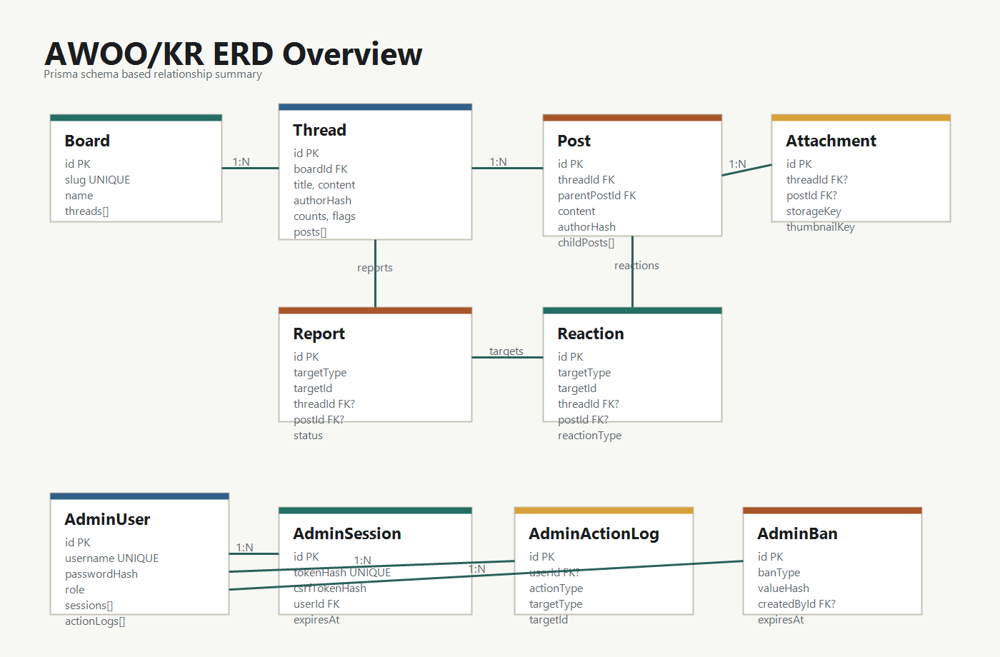
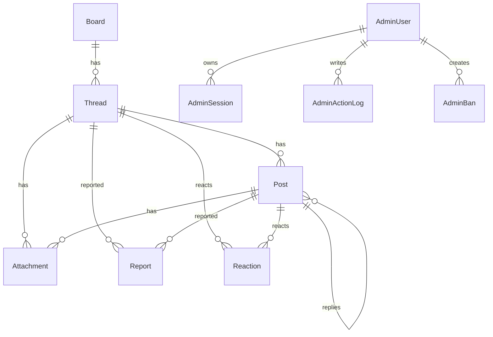

# AWOO/KR ERD

AWOO/KR의 데이터 모델은 Prisma schema를 기준으로 정리했습니다. 익명 게시판 기능을 중심으로 `Board`, `Thread`, `Post`, `Attachment`, `Report`, `Reaction`을 두고, 관리자 기능은 `AdminUser`, `AdminSession`, `AdminActionLog`, `AdminBan`으로 분리했습니다.

## 관계 요약

## 주요 테이블

### Board

게시판 카테고리를 저장합니다. `slug`를 unique 값으로 두고, 게시판별 스레드를 조회할 때 사용합니다.

### Thread

게시글 정보를 저장합니다. 게시판과 연결되며, 댓글, 첨부파일, 신고, 추천과 연결됩니다. 익명 작성자를 구분하기 위해 `authorHash`, `authorIpHash`를 사용합니다.

### Post

댓글과 대댓글을 저장합니다. `parentPostId`를 통해 대댓글 구조를 표현합니다. 삭제된 부모 댓글이 있어도 대댓글 흐름을 유지할 수 있도록 `isDeleted` 값을 둡니다.

### Attachment

업로드된 이미지의 메타데이터를 저장합니다. 게시글 또는 댓글에 연결될 수 있고, 원본 파일과 썸네일 파일의 key를 나눠 저장합니다.

### Report

게시글 또는 댓글 신고 정보를 저장합니다. `targetType`, `targetId`를 사용하고, 조회 편의를 위해 `threadId`, `postId`도 함께 둡니다.

### Reaction

게시글 또는 댓글에 대한 추천/비추천 정보를 저장합니다. 익명 사용자의 중복 반응을 줄이기 위해 `actorHash`를 사용합니다.

### AdminUser / AdminSession

관리자 계정과 로그인 세션 정보를 저장합니다. 세션 token과 CSRF token은 원문이 아니라 hash로 저장합니다.

### AdminActionLog / AdminBan

관리자 작업 기록과 차단 정보를 저장합니다. 신고 처리, 숨김 처리, 차단 생성/해제 흐름을 나중에 확인할 수 있게 하기 위한 테이블입니다.
